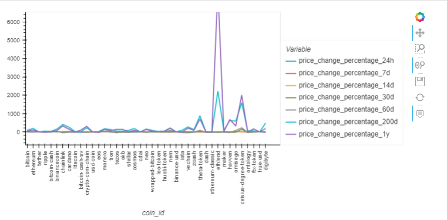
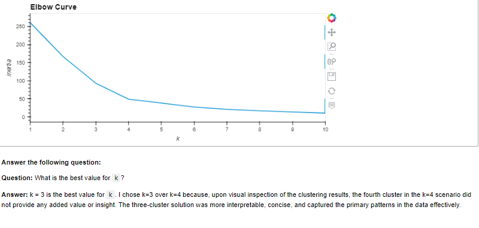
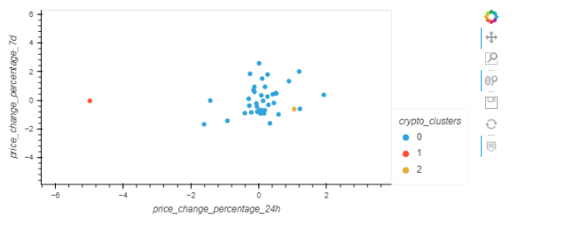
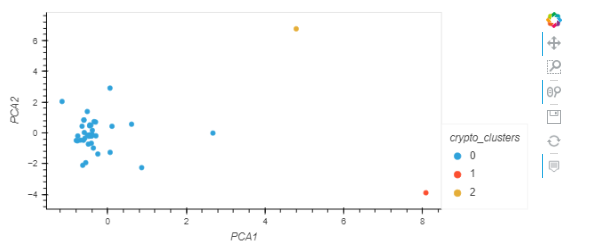
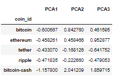
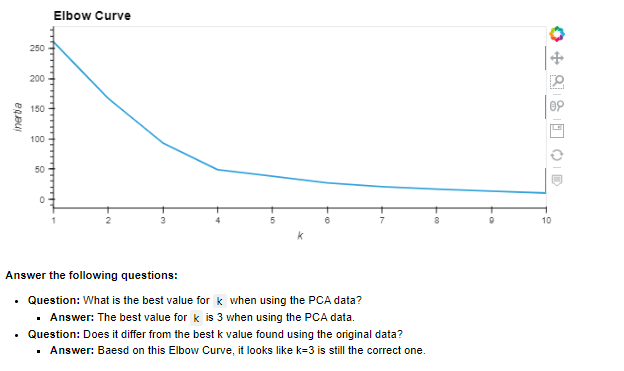
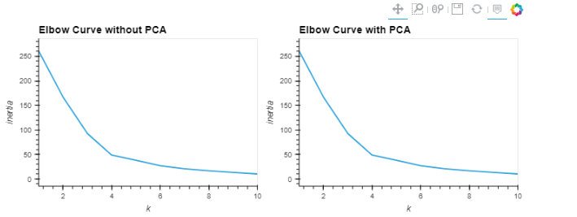
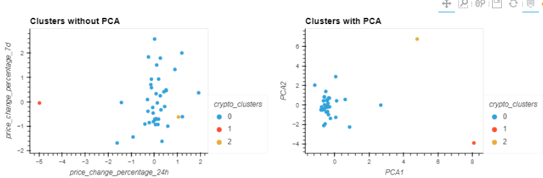

# CryptoClustering
This project aims to explore the relationship between short-term price changes and the overall behavior of cryptocurrencies. Utilizing Python and its vast ecosystem of data science libraries, I'll delve into the world of unsupervised learning to gain insights into this phenomenon.

## Instructions
1: Rename the **Crypto_Clustering_starter_code.ipynb** file as **Crypto_Clustering.ipynb**.

2: Load the **crypto_market_data.csv** into a DataFrame.

3: Get the summary statistics and plot the data to see what the data looks like before proceeding.

### Prepare the Data
- I'll use the StandardScaler() module from scikit-learn to normalize the data from the CSV file.
- Then I'll create a DataFrame with the scaled data and set the **"coin_id"** index from the original DataFrame as the index for the new DataFrame.
    - The first five rows of the scaled DataFrame should appear as follows:

### Find the Best Value for k Using the Original Scaled DataFrame

I'll use the elbow method to find the best value for k using the following steps:

- Create a list with the number of k values from 1 to 11.
- Create an empty list to store the inertia values.
- Create a for loop to compute the inertia with each possible value of k.
- Create a dictionary with the data to plot the elbow curve.
- Plot a line chart with all the inertia values computed with the different values of k to visually identify the optimal value for k.
- Answer the following question in your notebook: What is the best value for k?

- Create a scatter plot using hvPlot by setting 
     -`x="price_change_percentage_24h"` and `y="price_change_percentage_7d"`. 
     - Color the graph points with the labels found using K-Means and 
     - add the crypto name in the `hover_cols` parameter to identify the cryptocurrency represented by each data point.

### Cluster Cryptocurrencies with K-means Using the Original Scaled Data

I'll use the following steps to cluster the cryptocurrencies for the best value for k on the original scaled data:

- Initialize the K-means model with the best value for k.
- Fit the K-means model using the original scaled DataFrame.
- Predict the clusters to group the cryptocurrencies using the original scaled DataFrame.
- Create a copy of the original data and add a new column with the predicted clusters.
- Create a scatter plot using hvPlot as follows:
    - Set the x-axis as "PCA1" and the y-axis as "PCA2".
    - Color the graph points with the labels found using K-means.
    - Add the "coin_id" column in the hover_cols parameter to identify the cryptocurrency represented by each data point.

- Create a scatter plot using hvPlot by setting 
     - `x="PCA1"` and `y="PCA2"`. 
     - Color the graph points with the labels found using K-Means and 
     - add the crypto name in the `hover_cols` parameter to identify 
     - the cryptocurrency represented by each data point

### Optimize Clusters with Principal Component Analysis

- Using the original scaled DataFrame, perform a PCA and reduce the features to three principal components.
- Retrieve the explained variance to determine how much information can be attributed to each principal component and then I'll answer the following question in my notebook:
  
      - What is the total explained variance of the three principal components?
- Create a new DataFrame with the PCA data and set the "coin_id" index from the original DataFrame as the index for the new DataFrame.
     - The first five rows of the PCA DataFrame should appear as follows:

### Find the Best Value for k Using the PCA Data
I'll use the elbow method on the PCA data to find the best value for k using the following steps:

- Create a list with the number of k-values from 1 to 11.
- Create an empty list to store the inertia values.
- Create a for loop to compute the inertia with each possible value of k.
- Create a dictionary with the data to plot the Elbow curve.
- I'll Plot a line chart with all the inertia values computed with the different values of k to visually identify the optimal value for k.
- Answer the following question in my notebook:
     - What is the best value for k when using the PCA data?
     - Does it differ from the best k value found using the original data?

### Cluster Cryptocurrencies with K-means Using the PCA Data
I'll use the following steps to cluster the cryptocurrencies for the best value for k on the PCA data:

- Initialize the K-means model with the best value for k.
- Fit the K-means model using the PCA data.
- Predict the clusters to group the cryptocurrencies using the PCA data.
- Create a copy of the DataFrame with the PCA data and add a new column to store the predicted clusters.
- Create a scatter plot using hvPlot as follows:
     - Set the x-axis as "price_change_percentage_24h" and the y-axis as "price_change_percentage_7d".
     - Color the graph points with the labels found using K-means.
     - Add the "coin_id" column in the hover_cols parameter to identify the cryptocurrency represented by each data point.

### Visualize and Compare the Results

In this section, I will visually analyze the cluster analysis results by contrasting the outcome with and without using the optimization techniques.

- Answer the following question:
  
**What is the impact of using fewer features to cluster the data using K-Means?**
  
**Answer:**  The impact of using fewer features such as through PCA to cluster the data using K-Means are:
  
  **Clarity in Visualization:** The clusters visualized in a reduced-dimensional space (like PCA1 vs. PCA2) often appear more distinct and separated, leading to clearer visual interpretation.
  
  **Clustering Patterns:** The fact that the k-values are the same suggests that reducing the features has maintained the major structure and variance of the data. The reduced dimensionality through PCA effectively captured the key patterns and relationships present in the full feature set, as evidenced by the agreement in optimal k-values.
  
  **Visualization Clarity:** The scatter plot with PCA tends to be clearer and easier to interpret since it's visualized in a reduced dimension space. This helps in drawing quicker insights from the data.
  
  **Differences in Cluster Boundaries:** There might be subtle or even pronounced differences in how the boundaries between clusters are defined in the visualizations. This could mean that using fewer features, in some cases, can lead to a change in how certain data points are classified.

***References***

Data for this dataset was generated by edX Boot Camps LLC.

